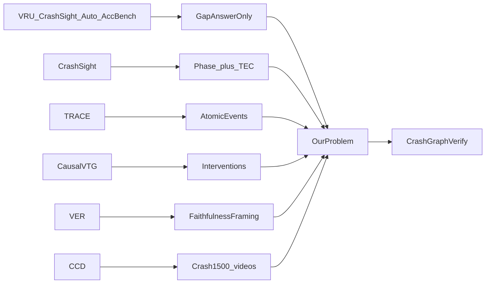
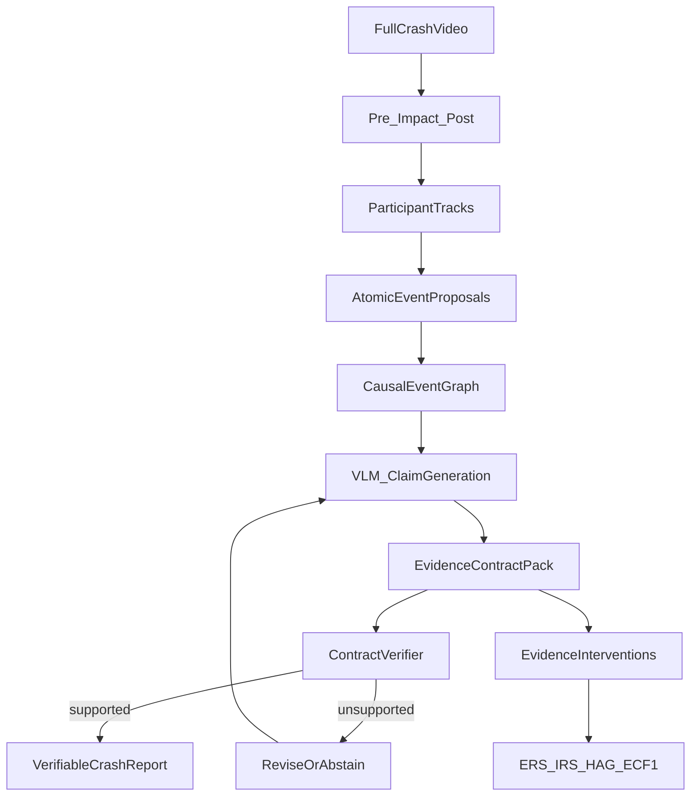

# From Video to Verifiable Crash Reports

**Related prior docs:** `PROJECT_COMPLETION_SUMMARY.md` (completed summarization), `EVIDENCE_CONDITIONED_FORECASTING_PROPOSAL.md` (anticipation — keep only as diagnostics)

---

## What we will do (action summary)

1. **Drop anticipation as the main task** (mentor feedback). Use the **complete crash video** and produce a **verifiable explanation** of what / how / why / who / where, plus what is uncertain.
2. **Build Crash-EC annotations** on top of Crash-1500: participants, atomic events with intervals, causal graph edges, claim–evidence contracts, uncertainty labels (deep annotate ~400–500 videos; reuse all 1500 broad fields).
3. **Define Temporal Evidence Contracts (TECs)** so every claim has text + supporting interval + participants + epistemic status + confidence.
4. **Implement CrashGraph-Verify** (training-free Generate–Verify–Revise): phase split → tracks → events → causal graph → claims → verifier → revise/abstain. **No classic LoRA caption finetuning** as the headline method.
5. **Run evidence interventions** (remove / keep-only / remove-irrelevant frames) and measure ERS, IRS, HAG, EC-F1, UCCR, causal-graph F1.
6. **Benchmark diverse VLMs zero-shot** (Qwen2.5/3-VL, InternVL3.5, LLaVA-Video, VideoLLaMA3, Molmo2, one larger open model, GPT video, Gemini video) plus method ablations.
7. **Optional:** small cross-domain TEC transfer (100–200 non-crash clips); optional verifier-guided preference alignment (not BLEU LoRA).
   

**Recommended title:** *From Video to Verifiable Crash Reports: Evidence-Grounded Causal Reasoning for Traffic Accidents*  
**Alternative:** *CrashGraph: Temporal Evidence Contracts for Explainable Traffic-Accident Video Understanding*

**Full mathematical formulation (GitHub-rendered):** see [README.md](README.md#mathematical-formulation) — TEC, interventions, HAG, metrics, optional losses.

---

## Verdict (what will get accepted)

**Do not** submit another “we caption crashes / we ask VQA / we fine-tune a VLM” paper. Completed LLaVA-NeXT work already shows the trap: LoRA improves BLEU/ROUGE but **hurts** NLI faithfulness (~66% → ~34%). That finding becomes the **motivating failure mode**, not the contribution.

**Submit** a general video-language problem instantiated on crashes:

> How do we evaluate and constrain video-language models so that each causal claim in an explanation is temporally grounded, participant-linked, epistemically labeled, and withdrawn when its cited evidence is removed?

Traffic crashes are the high-stakes domain. The transferable object is the **Temporal Evidence Contract (TEC)** + **Evidence Intervention Protocol**.

---

## What we already have (assets to reuse)

- **Videos:** `video1500/` — 1500 MP4s, ~5s @ 10fps, IDs `000001`–`001500`
- **GT Excel:** `Car_Crash_Text_Dataset_ground_truth.xlsx` — 11 fields (severity, vehicles, impact, crash start/end, explanation, ambiguity, camera, weather)
- **Processed:** `data/processed/annotations.json` — 1498 matched; splits 1048/224/226
- **Completed pipeline:** LLaVA-NeXT zero-shot + LoRA + ablations + NLI metrics (`PROJECT_COMPLETION_SUMMARY.md`)
- **Seed for epistemic labels:** ~103 non-empty `Ambiguity` notes (“unclear traffic signals”, color uncertainty, etc.)
- **Drop from main paper:** anticipation / TTA / early-warning from `EVIDENCE_CONDITIONED_FORECASTING_PROPOSAL.md` — keep only source-control and temporal-shuffle as *diagnostics*

---

## Literature map: papers → limitations → how we solve them

For each work: **dataset**, **method**, **limitation**, **how CrashGraph / TECs fix it**. Then: **which papers we follow as design references**.

### A. Accident / safety video benchmarks (direct competitors)

#### 1. VRU-Accident — Kim et al., ICCV Workshops 2025
- **Paper / link:** [arXiv:2507.09815](https://arxiv.org/abs/2507.09815), [GitHub](https://github.com/Kimyounggun99/VRU-Accident)
- **Dataset:** 1,000 real dashcam VRU–vehicle accident videos; 6,000 MCQ (6 categories including **cause**, **prevention**); 1,000 dense captions
- **Method:** Eval of **17 MLLMs** on MCQ accuracy + dense caption metrics
- **Limitation:** Judges final option/caption only; no claim→frame contracts; no evidence removal; no epistemic abstention
- **How we solve it:** TECs + Evidence Intervention (ERS/IRS) + undetermined claims when causes are not visible

#### 2. CrashSight — Gan et al., CVPR Workshops 2026 (DriveX)
- **Paper / link:** [arXiv:2604.08457](https://arxiv.org/abs/2604.08457), [project](https://mcgrche.github.io/crashsight/)
- **Dataset:** 250 roadside crash videos; **13K** MCQ; phase-aware dense captions (pre / impact / post)
- **Method:** Benchmark 8 VLMs; phase-preserving annotation; hallucination/robustness probes; domain FT gains
- **Limitation:** Still primarily MCQ correctness; no remove-supporting-frames test; no participant–event causal graph for free-form reports
- **How we solve it:** Keep **phases**; upgrade to claim-level TECs + interventions + causal graph \(G=(E,A)\)

#### 3. AUTOPILOT-VQA — CVPR 2026 competition track
- **Paper / link:** [arXiv:2607.08745](https://arxiv.org/abs/2607.08745)
- **Dataset:** 600+ dashcam clips; 6,000+ categorical QA (fault, impact, avoidability, etc.)
- **Method:** Fixed categorical VQA leaderboard (~0.66 top accuracy)
- **Limitation:** Closed answers; no free-form verifiable explanation; no evidence intervals
- **How we solve it:** Structured report \(R=(P,E,G,U,S)\) with contract verification

#### 4. AccidentBench — Gu et al., 2025
- **Paper / link:** [arXiv:2509.26636](https://arxiv.org/abs/2509.26636), [site](https://accident-bench.github.io/)
- **Dataset:** ~2,000 videos; ~19,000 QA; land / air / water; temporal / spatial / intent
- **Method:** Large multimodal reasoning benchmark; strongest models ~18% on hardest long videos
- **Limitation:** Still answer accuracy; does not verify evidence use or hindsight
- **How we solve it:** Borrow cross-domain idea for small TEC transfer; score evidence faithfulness

#### 5. SeeUnsafe — Zhang et al., Accident Analysis & Prevention 2025
- **Paper / link:** [GitHub ai4ce/SeeUnsafe](https://github.com/ai4ce/SeeUnsafe)
- **Dataset:** Primarily Toyota Woven Traffic Safety (WTS) demos
- **Method:** Tracking / segmentation / visual prompts + MLLM for identification, grounding, severity
- **Limitation:** Object/box grounding, not claim-level causal contracts
- **How we solve it:** Use tracking/prompts as modules inside CrashGraph-Verify; score **claims**

### B. Dataset lineage for our videos

#### 6. CCD / UString — Bao, Yu, Kong, ACM MM 2020
- **Paper / link:** [arXiv:2008.00334](https://arxiv.org/abs/2008.00334), [CCD GitHub](https://github.com/Cogito2012/CarCrashDataset)
- **Dataset:** CCD — **1,500** YouTube dashcam crash clips (50 frames @ 10 fps) + 3,000 BDD normal clips
- **Method:** Accident **anticipation** with spatio-temporal relational learning + uncertainty
- **Limitation:** Early-warning task, not verifiable post-hoc explanation; source bias crash vs normal
- **How we use it:** `video1500/` + Excel explanations = CCD crash subset + richer text GT. Cite CCD for origin; **reject anticipation as main task**

### C. Evidence / causal / motion papers (follow + differentiate)

#### 7. VER — Evidential Grounding for Robust Video Reasoning (NeurIPS 2025)
- **Link:** [NeurIPS 2025 PDF](https://papers.neurips.cc/paper_files/paper/2025/file/788f0d336eeddf698c8d527b1794fca4-Paper-Conference.pdf)
- **Method:** “Visual thinking drift”; Visual Evidence Reward (VER) RL for grounded CoT
- **Follow:** Fluent reasoning ≠ grounded reasoning
- **Differ:** TECs + physical frame interventions + epistemic crash reports (training-free first)

#### 8. CausalVTG — NeurIPS 2025
- **Link:** [OpenReview](https://openreview.net/forum?id=oeWgBOowL6)
- **Method:** Causal inference + counterfactual contrastive learning for temporal grounding
- **Follow:** Counterfactual / remove-evidence spirit → Interventions A/B/C
- **Differ:** Multi-claim crash reports, causal edges, HAG

#### 9. TRACE — Causal Event Modeling for Video LLM VTG
- **Link:** [arXiv:2410.05643](https://arxiv.org/abs/2410.05643)
- **Method:** Interleaved events = timestamps + saliency + captions
- **Follow:** Atomic events with intervals as first-class objects
- **Differ:** Participants, relation types, undetermined claims, intervention metrics

#### 10. MotionBench — CVPR 2025
- **Link:** [arXiv:2501.02955](https://arxiv.org/abs/2501.02955)
- **Method:** Shows VLMs are weak at fine-grained motion
- **Follow:** Motivation for explicit TEC intervals on short 5s crash clips

### D. What is NOT novel alone

VLM crash captioning, accident VQA, dense description, tracking, scene graphs, severity prediction, “why did the crash happen?”, coloured boxes alone.

Our LLaVA LoRA result (BLEU↑, NLI faithfulness↓) is local evidence of this gap.

### F. Papers we FOLLOW to build this plan (reference recipe)

1. **CrashSight** — phase-aware pre/impact/post + expert-refined annotation  
2. **VRU-Accident / AUTOPILOT-VQA / AccidentBench** — multi-VLM benchmarking culture; cite as answer-correctness-only  
3. **TRACE** — atomic event + timestamp representation  
4. **CausalVTG** — counterfactual evidence-absence testing → Interventions A/B/C  
5. **VER** — framing that thinking drifts from evidence; replace RL CoT with contracts + interventions  
6. **MotionBench** — fine-grained temporal eval motivation  
7. **SeeUnsafe** — tracking / visual-prompt modules only  
8. **CCD / Bao MM’20** — video source; reject anticipation as main task  
9. **Our Crash-1500 summarization pipeline** — motivating failure (text metrics ≠ faithfulness)

---

## Central problem formulation

> Complete symbol definitions, interventions, metrics, and optional losses with GitHub `$` / `$$` math: **[README.md § Mathematical formulation](README.md#mathematical-formulation)**.

Given full crash video:

$$
V = \{x_1, x_2, \ldots, x_T\}
$$

produce structured report:

$$
R = (P, E, G, U, S)
$$

- $P$: participants (type, colour, camera role, impact zone)
- $E$: atomic events with intervals
- $G = (E, A)$: causal event graph with relations in `{before, overlaps, enables, contributes-to, causes, contradicts}`
- $U$: uncertain / unanswerable claims
- $S$: natural-language summary

Every atomic claim must obey a **Temporal Evidence Contract**:

$$
c_k = (s_k,\; e_k=[t_k^{s}, t_k^{e}],\; O_k,\; r_k,\; q_k)
$$

with epistemic status:

$$
r_k \in \{\mathrm{observed},\; \mathrm{derived},\; \mathrm{hypothesised},\; \mathrm{undetermined}\}
$$

A report is accepted only if claims satisfy their contracts (or are explicitly marked undetermined).

**Key intervention / metric identities** (see README for full derivation):

$$
V_{-k} = V \setminus E_k,\quad
\mathrm{ERS} = \frac{1}{K}\sum_k \big[q(c_k\mid V)-q(c_k\mid V_{-k})\big]
$$

$$
\mathrm{HAG}(c) = q(c \mid V_{\mathrm{full}}) - q(c \mid V_{\mathrm{pre}})
$$

---

## Strong novelty stack (contribution order)

1. **Temporal Evidence Contracts** — claim = text + interval + participants + epistemic + confidence
2. **Evidence Intervention Evaluation**
   - A: remove supporting frames → confidence should drop (ERS ↑)
   - B: keep only supporting frames → claim recoverable
   - C: remove irrelevant frames → confidence stable (IRS ↑)
3. **Hindsight Attribution Gap (HAG)** — $q(c\mid V_{\mathrm{full}})-q(c\mid V_{\mathrm{pre}})$ for claims annotated as visible pre-impact
4. **CrashGraph-Verify** — training-free Generate–Verify–Revise (primary method)
5. **Crash-EC benchmark extension** of Crash-1500 with deep causal/evidence annotations

---

## Method: CrashGraph-Verify (no classic finetuning)

### Pipeline

1. **Phase segmentation** using `crash_start` / `crash_end` → $V_{\mathrm{pre}}\cup V_{\mathrm{impact}}\cup V_{\mathrm{post}}$
2. **Participant proposal** — detector/tracker (e.g. YOLO + ByteTrack); Molmo2 for pointing/tracking where useful
3. **Atomic event proposal** — VLM structured JSON events with intervals
4. **Causal edge scoring** — VLM/LLM over event pairs with temporal constraints
5. **Claim generation** — TEC-formatted claims from frames + tracks + graph + structured fields
6. **Contract verifier** — interval–claim alignment, participant consistency, contradictions, epistemic calibration
7. **Revise / abstain** if support score $<\gamma$
8. **Intervention audit** — build $V_{-k}$, $V_{+k}$, $V_{\mathrm{irr}}$ and re-query confidence

### Optional secondary (not caption LoRA)

Verifier-guided preference / intervention alignment on a small claim set (DPO/GRPO on contract satisfaction + ERS). Ablation only.

### What not to do

- Do not re-run LLaVA LoRA captioning as the main method
- Do not make anticipation the core task
- Do not use BLEU/ROUGE/CIDEr as primary understanding metrics

---

## Dataset annotation plan (quality > quantity)

Reuse all **1500** broad fields. Deep-annotate a high-quality core:

- Broad structured (existing): **1500** videos
- Atomic events + intervals: **600–800** (4–8 events/video)
- Causal graphs: **400–500** (3–6 edges/video)
- Claim–evidence contracts: **400–500** (5–10 claims + 2–4 uncertain)
- Triple-annotated gold test: **150–200**
- Interventions: auto-generated from contracts

Target for ~500 deep videos: ~2.5–4K events, ~1.5–3K edges, ~3–5K contracts.

**Bootstrap:** LLM-assisted draft from existing `Explanation` + crash window → human expert refine (CrashSight-style).

**Transfer:** 100–200 clips from one non-crash domain (falls / workplace / surveillance) with TECs only.

---

## Models for experiments

### Open VLMs (local)

1. Qwen2.5-VL-7B (or Qwen3-VL-8B if available)
2. InternVL3 / InternVL3.5-8B
3. LLaVA-Video-7B
4. VideoLLaMA3-7B
5. Molmo2-8B (grounding specialist)
6. One stronger open (~32B / MoE) if GPU allows

### Closed APIs

7. GPT-4o / latest OpenAI video-capable model
8. Gemini 2.5 Pro / latest Gemini video model

### Method ablations

- Raw VLM report
- VLM + uniform frames
- VLM + participant tracks
- VLM + scene graph
- VLM + event graph
- VLM + event graph + evidence verifier
- Full CrashGraph-Verify

---

## Primary metrics

- Claim Evidence Precision / Recall / EC-F1
- Evidence Removal Sensitivity (ERS)
- Irrelevant Removal Stability (IRS)
- Temporal Evidence IoU
- Causal Graph F1 (per relation)
- Unsupported Causal Claim Rate (UCCR ↓)
- Epistemic Status Macro-F1
- Report Consistency Score (RCS)
- Hindsight Attribution Gap (HAG)

**Secondary only:** event tIoU, severity/vehicle/impact F1, BERTScore/BLEURT/CIDEr/ROUGE-L, human factual correctness.

### Hypotheses

- **H1:** VLMs have high linguistic quality but low claim-level evidence grounding
- **H2:** Models often infer pre-crash causes from post-impact evidence
- **H3:** Tracks/event graphs help temporal/causal accuracy but not evidence faithfulness
- **H4:** Evidence contracts reduce unsupported causal claims
- **H5:** Faithful models drop confidence when true evidence is removed and stay stable when irrelevant frames are removed

---

## Main paper tables

1. Structured crash understanding
2. Causal reasoning (relation-wise F1)
3. Evidence contracts (CEP/CER/EC-F1/UCCR)
4. Intervention tests (ERS/IRS)
5. Epistemic reasoning
6. Ablation of CrashGraph-Verify modules

---

## Why NeurIPS (contribution statement)

Existing accident-video benchmarks primarily evaluate answer correctness or textual similarity, but they do not verify whether individual causal claims are supported by the cited temporal evidence. We introduce temporal evidence contracts, a causally annotated extension of CCD Crash-1500, evidence-intervention evaluation (including hindsight attribution), and CrashGraph-Verify, an event-graph-conditioned generate–verify–revise system. A small cross-domain transfer study shows TECs generalise beyond traffic crashes.

**Mentor one-liner:**  
*“Anticipation is a different task. We use the full crash video for verifiable explanation: participants + atomic events + causal graph + every claim tied to frames; then we remove those frames and test whether the model withdraws the claim.”*

---

## Execution roadmap

1. Freeze TEC JSON schema, relation set, epistemic labels, report structure \(R=(P,E,G,U,S)\)
2. Annotation protocol + pilot 50 videos → IAA → scale to 400–500 deep
3. Unified multi-VLM inference harness (beyond LLaVA-only `src/models/unified_vlm.py`)
4. Implement CrashGraph-Verify + automatic interventions + HAG splits
5. Metrics suite (EC-F1, ERS, IRS, HAG, CG-F1); Tables 1–6
6. Human eval on 150–200 gold; optional transfer study
7. Optional verifier preference alignment
8. Paper writing

### Implementation todos

- [ ] Freeze TEC schema and report structure
- [ ] Annotation pilot (50) then scale (400–500)
- [ ] Multi-VLM zero-shot harness
- [ ] CrashGraph-Verify + interventions
- [ ] Metrics + main tables
- [ ] Human eval + optional transfer

---

## Risk controls

- Start with 50-video pilot; do not deeply annotate all 1500
- Short 5s clips → fine-grained within-clip contracts
- Calibrate confidence consistently across models (logprob / self-consistency / Likert)
- Do not overclaim “causality discovery”; claim evidence-constrained causal graph prediction under human annotations
- Cite VER / CausalVTG / TRACE early to pre-empt “already done” reviews
