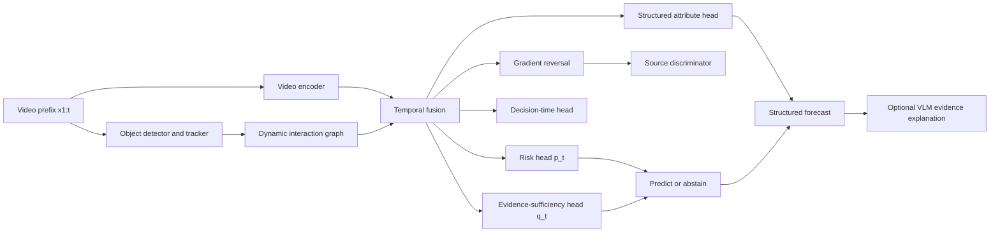
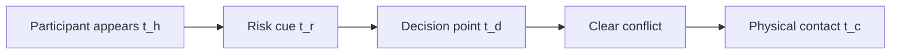
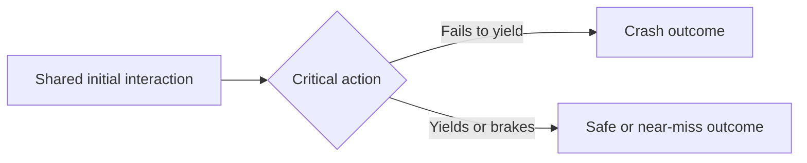

# When Early Prediction Is Just Early Guessing

## Evidence-Conditioned Selective Forecasting for Rare-Event Videos


---

## 1. Executive summary

Traffic-accident anticipation models are usually rewarded for predicting a future collision as early as possible. On benchmarks such as CCD, however, an early prediction may be based on dataset source, background appearance, fixed event timing, or static scene cues rather than visible collision-causing interactions.

This project asks a stricter question:

> **When does the video contain enough evidence to justify a prediction?**

We propose an evidence-conditioned forecasting framework that:

1. estimates future accident risk over time;
2. predicts whether sufficient visual evidence is currently available;
3. remains calibrated and can abstain before sufficient evidence appears;
4. identifies the participants and interaction supporting its decision;
5. is evaluated using source controls, temporal perturbations, matched crash/control videos, and decision-time annotations.

The intended scientific contribution is not another small improvement in random-split Average Precision. It is a framework for separating:

- genuine evidence-based forecasting;
- premature guessing from dataset priors;
- source and scene shortcut exploitation;
- post-impact recognition incorrectly presented as anticipation.

The current repository is sufficient for a positive-only pilot but **not** the complete paper. The full study requires reliable normal/near-miss controls, source metadata, and new decision-time annotations.

---

## 2. Verified local dataset

### 2.1 Available assets

The repository currently contains:

- **1,500 MP4 crash-corpus clips** in `video1500/`;
- exactly **50 frames per video**;
- **10 FPS**;
- exactly **5 seconds per clip**;
- 1,465 videos at 1280×720;
- 19 videos at 640×360;
- 16 videos at 960×720;
- a 1,500-row annotation workbook:
  `Car_Crash_Text_Dataset_ground_truth.xlsx`;
- **1,498 usable annotation records**;
- existing random split: 1,048 train / 224 validation / 226 test.

The workbook provides:

- crash severity;
- vehicle descriptions;
- number of vehicles;
- impact location;
- crash start and end;
- free-text explanation;
- ambiguity;
- camera view;
- weather.

### 2.2 Data-quality findings

Known issues that must be handled explicitly:

- `000852` and `000868` have empty core annotations;
- `000651` has an invalid temporal ordering: start 4 s, end 3 s;
- `000776` contains near-miss/no-accident language but conflicting labels;
- approximately 82–83 records resemble weak no-event/insufficiency cases;
- severity has case and spelling variation;
- vehicle descriptions and impact locations are uncontrolled free text;
- ambiguity is empty for approximately 93% of records;
- crash times are integer-second labels, not frame-accurate boundaries;
- no source URL, uploader, original video ID, or license field is present;
- the official 3,000 CCD normal/BDD100K videos are not present locally;
- no reliable matched near-miss set is present.

### 2.3 Crash-start distribution

Approximate crash-start distribution:

| Start time | Videos |
|---:|---:|
| 0 s | 123 |
| 1 s | 248 |
| 2 s | 573–574 |
| 3 s | 497 |
| 4 s | 56 |

This creates a strong temporal-position prior. A model can learn that collisions usually occur around 2–3 seconds without understanding traffic interactions.

### 2.4 What current data supports

Valid current-data tasks:

- coarse crash-onset localization;
- positive-only, pre-impact attribute forecasting;
- horizon-conditioned evidence-sufficiency analysis;
- structured post-impact reporting;
- temporal perturbation diagnostics;
- exploratory analysis of weak no-event records with full disclosure.

Unsupported claims with current data alone:

- balanced accident detection;
- real-world false-alarm performance;
- source-disjoint YouTube-vs-BDD generalization;
- reliable crash-vs-near-miss discrimination;
- causal counterfactual reasoning;
- frame-accurate risk onset;
- deployment readiness.

---

## 3. Why the existing repository method is not the proposed method

The current non-collage pipeline extracts multiple frames but sends only the middle frame to LLaVA. Consequently, the existing sampling experiment mostly changes the selected timestamp.

Additional problems include:

- the “dense” cache stores only frames 0–29, covering 2.9 of 5 seconds;
- sparse caches cover different temporal extents;
- configuration states 30 FPS although all videos are 10 FPS;
- the canonical 66.4% NLI result has no matching per-video evidence;
- the current same-named rerun reports approximately 3.1% NLI;
- NLI optimization uses test references to filter generated sentences;
- reference-text NLI is not video-grounded factuality;
- zero-shot single-frame images have a BGR/RGB inconsistency;
- old training loss/checkpoint artifacts mix configurations.

These results will not be used as evidence for the new hypothesis. Existing LLaVA outputs may be retained only as descriptive controls.

---
## 4. Scientific problem

Let a video be:

$$
X = \{x_1, x_2, \ldots, x_T\}
$$

where $x_t$ is the frame at time $t$. Let

$$
y \in \{0,1\}
$$

denote whether the sequence culminates in an accident.

A conventional anticipation model estimates:

$$
p_t = P(y=1 \mid x_{1:t})
$$

We represent the observed video as:

$$
X = G(C,S,E)
$$

where:

- $C$: collision-relevant interaction dynamics;
- $S$: recording/source style;
- $E$: environment and scene context.

Examples of $C$:

- relative trajectories;
- lane departure;
- closing velocity;
- failure to yield;
- braking or failure to brake;
- collision geometry.

Examples of $S$:

- YouTube versus BDD100K origin;
- codec and compression;
- watermark or overlay;
- frame border;
- camera pipeline;
- resolution and bitrate.

Examples of $E$:

- weather;
- road type;
- time of day;
- traffic density;
- camera viewpoint.

The desired model learns:

$$
P(y \mid C)
$$

but empirical risk minimization may learn:

$$
P(y \mid S,E)
$$

The central benchmark-validity question is whether strong accident-anticipation scores remain strong after source, background, temporal-position, and static-frame shortcuts are controlled.
---

## 5. Decision-time formulation

For each positive video, define:

- $t_h$: first appearance of a potentially relevant participant or hazard;
- $t_r$: first observable risk cue;
- $t_d$: decision/divergence point;
- $t_c$: physical contact or annotated crash onset.

The key variable is $t_d$:

> The earliest time at which trained annotators can distinguish the future crash trajectory from an appropriately matched non-crash outcome using visible evidence.

Before $t_d$, high confidence may represent premature guessing. After $t_d$, risk should rise if the model uses collision-relevant evidence.

Decision time is subjective and must be annotated using:

- a precise written protocol;
- at least two independent annotators;
- adjudication for disagreements;
- frame-tolerance agreement;
- mean absolute annotator difference;
- Krippendorff's $\alpha$;
- explicit "insufficient evidence" and "uncertain boundary" options.
---

## 6. Central novelty

### 6.1 Novelty statement

> We study when rare-event video models have sufficient visual evidence to justify a forecast. We introduce decision-time supervision and matched outcome-divergence controls, evaluate premature confidence before distinguishing evidence appears, and propose a selective temporal model that predicts only when evidence is sufficient.

### 6.2 What is new as an integrated contribution

The proposed contribution connects four elements:

1. **Benchmark forensics**  
   Diagnose source, background, static-frame, and temporal-position shortcuts.

2. **Evidence-conditioned evaluation**  
   Separate useful warning after evidence appears from unjustified early confidence.

3. **Selective temporal forecasting**  
   Jointly estimate accident risk and whether the evidence is sufficient; abstain when it is not.

4. **Matched outcome-divergence learning**  
   Keep risk similar while a crash and matched control are visually equivalent, then separate them after behavior diverges.

Individual components such as temporal grounding, calibration, abstention, source invariance, and graph interaction modeling already exist. The novelty claim is their experimentally validated integration around **evidence availability**, not that each component is individually unprecedented.

### 6.3 Claims we will not make

- guaranteed safety;
- formal causal identification from observational dashcam footage;
- legal responsibility assessment;
- true counterfactuals from merely similar videos;
- first risk-cue benchmark;
- first temporal-order test;
- first VLM for accident understanding;

---

## 7. Dataset and annotation plan

### 7.1 Current-data pilot

Using only current local assets:

1. clean the 1,498 usable records;
2. quarantine malformed and weak no-event records;
3. create prefixes ending strictly before crash onset:

$$
X^{(h)}_i = x_{i,1:t_{c,i}-h},
\quad h \in \{1,2,3\}\text{ seconds}
$$

4. forecast eventual structured attributes, conditional on the known fact that the corpus is crash-positive;
5. measure how evidence sufficiency changes with horizon;
6. compare ordered, shuffled, reversed, last-frame-only, and order-invariant inputs.

This pilot must be called:

> **Positive-only pre-impact structured forecasting**

It is not general accident detection.

### 7.2 Required full-paper additions

For the complete A*-level study:

- restore the official CCD normal set or a license-compatible equivalent;
- restore original source/YouTube identifiers;
- acquire comparable near-miss and non-crash clips;
- create source and duplicate groups;
- annotate 300–500 decision times;
- create approximately 300 matched crash/control pairs;
- double-annotate at least 150 pairs;
- lock at least 100 pairs for final evaluation;
- evaluate on an independently sourced accident dataset;

### 7.3 Matched controls versus counterfactuals

A pair:

$$
(X_i^+, X_i^-)
$$

should match:

- road type;
- camera style;
- weather and lighting;
- vehicle classes;
- traffic density;
- initial relative trajectories.

The pair should differ around a critical action, for example:

- yields versus fails to yield;
- brakes versus does not brake;
- corrects drift versus continues drifting;
- stops before entering versus enters the path.

Retrieved real videos are **matched observational controls**. They are not true counterfactuals because unobserved variables may differ. Use "counterfactual" only for validated simulation/intervention pairs.

---

## 8. Split design

### Split A — Original random split

Used only to reproduce earlier work. It is not the primary validity result.

### Split B — Group/source-disjoint split

No original source video, uploader/channel family, duplicate cluster, or adjacent segment may cross train/test:

$$
\mathcal{S}_{train} \cap \mathcal{S}_{test} = \varnothing
$$

### Split C — Environment-disjoint split

Hold out selected conditions such as:

- night;
- rain/snow;
- intersections;
- highways;
- uncommon camera views.

### Split D — Matched-pair split

Both members of a matched pair must remain in the same fold.

### Split E — Cross-dataset evaluation

Train on CCD-derived data and test on independently sourced data such as:

- DAD;
- A3D;
- DoTA;
- ACCIDENT 2026 where licensing permits;
- another independent crash/near-miss corpus.

### Current-data grouped folds

Before external data is available:

- compute perceptual hashes/video embeddings;
- cluster possible near duplicates;
- keep clusters intact;
- stratify approximately by onset second, severity, weather, and camera-view family;
- use five grouped folds or a locked grouped 70/15/15 split;
- keep all prefixes from one video in the same fold.
---

## 9. Proposed architecture: EviForecaster

### 9.1 Design principle

The VLM is not the sole safety predictor. The main risk estimator is a temporal visual/interaction model. A VLM is used secondarily for structured evidence descriptions.



### 9.2 Visual representation

Use VideoMAE-Large as the primary backbone:

$$
z^v_t = E_v(x_{1:t})
$$

### 9.3 Tracked-agent representation

For participant $j$ at time $t$:

$$
o_{j,t} =
[b_{j,t}, c_j, \Delta p_{j,t}, v_{j,t}, a_{j,t}, \rho_{j,t}]
$$

where:

- $b_{j,t}$: bounding box;
- $c_j$: object class;
- $\Delta p_{j,t}$: displacement;
- $v_{j,t}$: estimated velocity;
- $a_{j,t}$: estimated acceleration;
- $\rho_{j,t}$: track confidence.

For participants $j,k$:

$$
e_{jk,t} =
[d_{jk,t}, \Delta v_{jk,t}, \theta_{jk,t},
r_{jk,t}, \operatorname{IoU}_{jk,t}]
$$

where:

- $d_{jk,t}$: relative image-space distance;
- $\Delta v_{jk,t}$: relative velocity;
- $\theta_{jk,t}$: relative direction;
- $r_{jk,t}$: closing-rate proxy.

The interaction graph encoder produces:

$$
z^g_t = E_g(G_{1:t})
$$

### 9.4 Causal-dynamics representation

$$
z^c_t = F(z^v_t, z^g_t)
$$

This is called a collision-relevant representation, not a formally identified causal representation.

### 9.5 Prediction heads

Accident risk:

$$
p_t = \sigma(W_p z^c_t + b_p)
$$

Evidence sufficiency:

$$
q_t = \sigma(W_q z^c_t + b_q)
$$

Decision-time probability:

$$
d_t = \sigma(W_d z^c_t + b_d)
$$

Structured outcome:

$$
\hat{a}_t = g_a(z^c_t)
$$

covering normalized fields such as vehicle count/classes, impact configuration, and coarse severity.

### 9.6 Selective stopping rule

For sufficiency threshold $\eta$ and risk threshold $\gamma$:

$$
\tau_i =
\min\{t:q_{i,t}\ge\eta
\land \max(p_{i,t},1-p_{i,t})\ge\gamma\}
$$

If no time satisfies the rule, the system abstains:

$$
\hat{y}_i =
\begin{cases}
\mathbb{1}[p_{i,\tau_i}\ge 0.5], & \tau_i\ \text{exists},\\
\text{abstain}, & \text{otherwise}.
\end{cases}
$$

Thresholds are selected on validation data only.

---

# 10. Training Objectives

## 10.1 Time-Weighted Anticipation Loss

The anticipation objective predicts future collision probability over time while accounting for decision relevance.

$$
\mathcal{L}_{ant}
=
-\frac{1}{N}
\sum_{i=1}^{N}
\sum_{t=1}^{T}
w_{i,t}
\left[
y_i\log p_{i,t}
+
(1-y_i)\log(1-p_{i,t})
\right]
$$

The weighting function $w_{i,t}$ must not reward arbitrary early confidence. 
Weights are selected relative to annotated decision/contact times and validated through ablation studies.

---

## 10.2 Decision-Time Loss

Let $r_{i,t}$ be a soft target centered around the annotated decision time $t_{d,i}$:

$$
r_{i,t}
=
\exp
\left(
-\frac{(t-t_{d,i})^2}{2\sigma_d^2}
\right)
$$

The decision-time loss is:

$$
\mathcal{L}_{dec}
=
-\frac{1}{N}
\sum_{i,t}
\left[
r_{i,t}\log d_{i,t}
+
(1-r_{i,t})\log(1-d_{i,t})
\right]
$$

---

## 10.3 Pre-Evidence Suppression Loss

For positive samples:

$$
\mathcal{L}_{pre}
=
\frac{1}{N_+}
\sum_{i:y_i=1}
\frac{1}{\max(1,t_{d,i}-1)}
\sum_{t<t_{d,i}}
\max(0,p_{i,t}-\delta)^2
$$

where $\delta$ represents the permissible background-risk level selected using validation calibration.

This loss does not assume accident probability is zero before $t_d$.  
It discourages unjustified high-confidence predictions before sufficient evidence exists.

---

## 10.4 Matched-Pair Ranking Loss

$$
\mathcal{L}_{pair}
=
\frac{1}{N_p}
\sum_{i=1}^{N_p}
\max
\left(
0,
m-(p^+_{i,t^*}-p^-_{i,t^*})
\right)
$$

where $t^*$ is the predefined post-divergence evaluation time.

---

## 10.5 Pre-Divergence Consistency Loss

$$
\mathcal{L}_{same}
=
\frac{1}{N_p}
\sum_i
\frac{1}{t_{d,i}-1}
\sum_{t<t_{d,i}}
(p^+_{i,t}-p^-_{i,t})^2
$$

This encourages matched pairs to remain similar before the actual divergence point.

---

## 10.6 Post-Divergence Separation Loss

$$
\mathcal{L}_{div}
=
\frac{1}{N_p}
\sum_i
\frac{1}{t_{c,i}-t_{d,i}+1}
\sum_{t=t_{d,i}}^{t_{c,i}}
\max
\left(
0,
m_t-(p^+_{i,t}-p^-_{i,t})
\right)
$$

---

## 10.7 Style-Invariance Loss

Let $A_s$ modify visual style properties such as compression, color, resolution, borders, overlays, or noise while preserving motion.

$$
X'_i=A_s(X_i)
$$

The invariance objective is:

$$
\mathcal{L}_{inv}
=
\frac{1}{N}
\sum_i
\left\|
E_c(X_i)-E_c(X'_i)
\right\|_2^2
$$

All augmentations must be audited to ensure that traffic dynamics remain unchanged.

---

## 10.8 Source-Adversarial Loss

For source label $s_i$:

$$
\mathcal{L}_{src}
=
-\frac{1}{N}
\sum_i
\log
P
(s_i|\operatorname{GRL}(z^c_i))
$$

The gradient reversal layer reverses the encoder gradient.

Therefore:

- $\mathcal{L}_{src}$ is added with a positive coefficient.
- It must not be negated again in the final objective.

Source adversarial training is valid only when source is not perfectly correlated with class labels.

---

## 10.9 Calibration Loss

A Brier-style calibration loss:

$$
\mathcal{L}_{cal}
=
\frac{1}{NT}
\sum_{i,t}
(p_{i,t}-y_i)^2
$$

Calibration must also be evaluated after training because minimizing Brier loss alone does not guarantee calibration under distribution shift.

---

## 10.10 Structured Outcome Loss

$$
\mathcal{L}_{attr}
=
\sum_{k\in\mathcal{A}}
\lambda_k
CE(\hat{a}_{i,k},a_{i,k})
$$

Use:

- masked loss for missing attributes;
- multi-label BCE for vehicle sets.

---

# 10.11 Final Training Objective

$$
\mathcal{L}_{total}
=
\mathcal{L}_{ant}
+\lambda_{dec}\mathcal{L}_{dec}
+\lambda_{pre}\mathcal{L}_{pre}
+\lambda_{pair}\mathcal{L}_{pair}
+\lambda_{same}\mathcal{L}_{same}
+\lambda_{div}\mathcal{L}_{div}
+\lambda_{inv}\mathcal{L}_{inv}
+\lambda_{src}\mathcal{L}_{src}
+\lambda_{cal}\mathcal{L}_{cal}
+\lambda_{attr}\mathcal{L}_{attr}
$$

Not all objectives should be activated initially.

Each component requires controlled ablation.

Loss terms requiring unavailable annotations remain disabled in the current-data pilot.

---

# 11. Primary Model Families

Seven primary families are evaluated after successful go/no-go diagnostics.

| ID | Family | Model | Purpose |
|---|---|---|---|
| 1 | Classical anticipation | UString / CCD model | Original CCD reference |
| 2 | Interaction graph anticipation | Graph(Graph), WACV 2024 | Tests relational reasoning |
| 3 | Video foundation model | VideoMAE-Large (`MCG-NJU/videomae-large`) | Primary temporal backbone |
| 4 | Self-supervised video model | InternVideo2-1B | Strong video representation baseline |
| 5 | Video-language model | Qwen2.5-VL-7B-Instruct | Zero-shot/few-shot reasoning |
| 6 | Video-language model | LLaVA-Video-7B-Qwen2 | Independent VLM baseline |
| 7 | Proposed method | EviForecaster | Evidence-conditioned forecasting |

---

## Optional Supplementary Baselines

Additional experiments may include:

- Video Swin-Large
- InternVL2.5/3 (~8B)
- One 20B–32B multimodal model for scaling analysis
- Optical-flow logistic regression
- CNN-GRU
- Order-invariant pooling with identical visual encoder

The contribution should come from methodology, not from training many large VLMs.

---
# 12. VLM Protocol

Vision-language models (VLMs) receive video prefixes at fixed observation horizons:

- 0.5 s
- 1.0 s
- 1.5 s
- 2.0 s
- Continuing to the maximum available prefix length

All VLM evaluations use one shared constrained output schema:

```json
{
  "future_collision_probability": 0.0,
  "evidence_sufficient": false,
  "risk_participants": [],
  "visible_evidence": [],
  "forecast_vehicle_count": null,
  "forecast_vehicle_types": [],
  "forecast_impact_configuration": null,
  "uncertainty_reason": "insufficient temporal evidence"
}
```

## Evaluation Rules

- Both VLMs are evaluated using zero-shot inference.
- LoRA fine-tuning is allowed on at most one open VLM.
- Frames, prompts, output schema, and decoding parameters must remain identical across models.
- Ground-truth labels are never provided during test inference.
- Malformed JSON outputs are counted and reported.
- Chain-of-thought generation is not required.
- Free-text explanations are evaluated separately from accident prediction performance.

---

# 13. Diagnostic Transformations

Diagnostic transformations are used to identify shortcut learning, temporal dependence, and robustness failures.

---

## 13.1 First-Frame Test

Only the first video frame is provided:

$$
X_{first}=\{x_1\}
$$

High performance indicates possible reliance on static scene information or source-specific shortcuts.

---

## 13.2 Background-Only Test

Given a road-user mask $M_t$:

$$
\tilde{x}^{BG}_t=x_t\odot(1-M_t)
$$

This removes dynamic agents while preserving background information.

High accident prediction performance suggests that background or dataset-specific information may be influencing predictions.

---

## 13.3 Agent-Only Test

The model receives only road-user regions:

$$
\tilde{x}^{FG}_t=x_t\odot M_t
$$

This evaluates whether predictions depend primarily on interacting agents rather than scene context.

---

## 13.4 Shuffled Frames

Frames are randomly permuted using permutation $\pi$:

$$
X_{shuffle}
=
\{x_{\pi(1)},x_{\pi(2)},...,x_{\pi(T)}\}
$$

A large performance decrease indicates dependence on temporal ordering.

---

## 13.5 Reversed Frames

Temporal order is reversed:

$$
X_{reverse}
=
\{x_T,x_{T-1},...,x_1\}
$$

This tests whether the model understands forward causal evolution rather than only visual appearance.

---

## 13.6 Repeated-Frame Test

A single frame is repeated:

$$
X_{repeat}^{(k)}
=
\{x_k,x_k,...,x_k\}
$$

Strong performance indicates possible reliance on static appearance rather than temporal evidence.

---

## 13.7 Metadata-Only Test

No semantic visual information is provided.

Metadata features may include:

$$
m=
[
\text{resolution},
\text{bitrate},
\text{codec},
\text{border statistics},
\text{color statistics},
\text{frame-size statistics}
]
$$

Metadata features must be defined before test evaluation to prevent post-hoc feature selection.

---

## 13.8 Temporal-Position Control

Event timing is randomly shifted or cropped when valid.

The transformation prevents models from exploiting fixed temporal priors such as:

> "The accident occurs near frame 30."

All transformations must preserve labels and remain within the available video context.

---

# 14. Metrics

## 14.1 Standard Metrics

Report:

- Average Precision (AP)
- Mean Time-to-Accident (TTA)
- TTA at fixed recall levels:
  - 50%
  - 70%
  - 80%
- False alarms per hour
- Expected Calibration Error (ECE)
- Brier score
- Negative log-likelihood (NLL)

For threshold-crossing time $\tau_i$:

$$
\operatorname{TTA}_i
=
t_{c,i}-\tau_i
$$

TTA must always be reported together with the corresponding recall, precision, or false-alarm operating point.

---

## 14.2 Evidence-Conditioned Warning Time (ECWT)

$$
\operatorname{ECWT}_i
=
t_{c,i}-\max(\tau_i,t_{d,i})
$$

ECWT measures warning time after evidence becomes available.

It must be reported together with pre-evidence risk because ECWT alone does not penalize premature predictions.

---

## 14.3 Pre-Evidence Risk (PER)

$$
\operatorname{PER}
=
\frac{1}{N_+}
\sum_{i:y_i=1}
\frac{1}{t_{d,i}-1}
\sum_{t<t_{d,i}}
p_{i,t}
$$

Lower PER indicates fewer unsupported early warnings.

---

## 14.4 Matched-Pair Accuracy (MPA)

$$
\operatorname{MPA}
=
\frac{1}{N_p}
\sum_{i=1}^{N_p}
\mathbb{1}
[
f(X_i^+)>f(X_i^-)
]
$$

The term **Counterfactual Pair Accuracy** should only be used when the pairs represent genuine controlled interventions.

---

## 14.5 Pairwise Ranking Margin (PRM)

$$
\operatorname{PRM}
=
\frac{1}{N_p}
\sum_i
\left[
f(X_i^+)-f(X_i^-)
\right]
$$

---

## 14.6 Temporal Dependence Gap (TDG)

$$
\operatorname{TDG}
=
\operatorname{AP}_{ordered}
-
\operatorname{AP}_{shuffled}
$$

Also report:

- reversed-frame performance
- repeated-frame performance

separately.

---

## 14.7 First-Frame and Background Shortcut Retention

### First-Frame Shortcut Score

$$
\operatorname{FFS}
=
\frac{
\operatorname{AP}_{first}
}
{
\max(\epsilon,\operatorname{AP}_{full})
}
$$


### Background Shortcut Score

$$
\operatorname{BSS}
=
\frac{
\operatorname{AP}_{background}
}
{
\max(\epsilon,\operatorname{AP}_{full})
}
$$

Lower shortcut retention is preferred while maintaining strong full-video performance.

---

## 14.8 Shortcut Reliance Index (SRI)

$$
\operatorname{SRI}
=
\frac{
\operatorname{AP}_{first}
+
\operatorname{AP}_{background}
+
\operatorname{AP}_{shuffled}
+
\operatorname{AP}_{metadata}
}
{
4\max(\epsilon,\operatorname{AP}_{full})
}
$$

SRI is a secondary diagnostic metric.

All individual components must always be reported separately.
### 14.9 Selective prediction

Report:

- coverage;
- selective risk;
- risk–coverage curve;
- Area Under the Risk–Coverage curve;
- accuracy/calibration at fixed coverage.

### 14.10 Current positive-only metrics

For the local pilot:

- onset MAE and median absolute error in seconds;
- accuracy within ±1 s;
- interval IoU where meaningful;
- structured-attribute macro-F1;
- balanced accuracy;
- vehicle-set F1;
- Brier/ECE/NLL;
- ordered-minus-shuffled paired difference;
- all metrics by pre-impact horizon and onset bin.
---

## 15. Main hypotheses

### H1 — Shortcut availability

Existing CCD models retain substantial predictive performance with non-causal source/background information.

Evidence:

- first-frame AP above chance;
- background-only AP above chance;
- metadata-only AP above chance.

### H2 — Weak temporal dependence

Existing models retain much of their performance after frame order is destroyed.

Evidence:

- small TDG;
- high repeated-frame performance;
- weak ordered-versus-reversed difference.

RiskCueBench has already reported small VLM degradation under shuffling/reversal, so our contribution must extend beyond merely repeating this observation.

### H3 — Random split inflation

$$
\Delta AP_{source}
=
AP_{random}-AP_{source\text{-}disjoint}>0
$$

The hypothesis requires source metadata and cannot be tested with current local data alone.

### H4 — Premature confidence

Long conventional TTA can coexist with high PER and poor calibration.

### H5 — Evidence-conditioned model

EviForecaster improves:

- source-disjoint AP;
- matched-pair accuracy;
- ECWT at controlled PER;
- calibration;
- selective risk;

while lowering shortcut reliance.

It does not need to win random-split AP if it generalizes better under controlled evaluation.

---

## 16. Experiment schedule

### Phase 0 — Data audit and go/no-go

1. Normalize structured annotations.
2. Quarantine malformed/weak labels.
3. Audit duplicates and temporal cutoffs.
4. Recover or acquire normal/source-controlled data.
5. Write and pilot decision-time annotation protocol.

### Phase 1 — Cheap hypothesis tests

Use only:

- UString;
- VideoMAE-Large;
- Qwen2.5-VL-7B.

Run:

- full video;
- first frame;
- repeated frame;
- shuffled/reversed;
- background-only;
- metadata-only;
- original versus grouped/source-disjoint split where possible;
- pre-evidence risk curves.

**Go/no-go:** proceed only if shortcut behavior or controlled-evaluation degradation is statistically meaningful.

### Phase 2 — Current-data positive-only pilot

1. Create prefixes at 1/2/3 s before onset.
2. Run majority, last-frame, pooled-frame, optical-flow, and CNN-GRU baselines.
3. Predict normalized structured attributes.
4. Evaluate abstention/evidence sufficiency.
5. Test ordered versus shuffled/reversed.

### Phase 3 — Full seven-family baseline suite

Add:

- Graph(Graph);
- InternVideo2-1B;
- LLaVA-Video-7B.

Use identical controlled splits and perturbations.

### Phase 4 — EviForecaster

Incremental configurations:

1. VideoMAE-Large base;
2. + interaction graph;
3. + decision-time head;
4. + pre-evidence suppression;
5. + matched-pair ranking;
6. + pre/post-divergence objectives;
7. + style invariance;
8. + source adversarial objective;
9. + calibrated selective stopping.

### Phase 5 — Cross-dataset/domain

- train on CCD-derived development data;
- test on independent accident data;
- optionally test evidence-conditioned forecasting in another rare-event domain.

---

## 17. Required ablations

| Configuration | Purpose |
|---|---|
| Last frame only | Static-scene shortcut |
| Uniform average pooling | Order-free video baseline |
| Ordered temporal encoder | Temporal contribution |
| + interaction graph | Participant relations |
| + decision head | Decision-time supervision |
| + pre-evidence suppression | Premature confidence |
| + pair ranking | Crash/control separation |
| + pre-divergence consistency | Pair equivalence before evidence |
| + post-divergence separation | Outcome divergence |
| + style invariance | Recording robustness |
| + source adversarial | Source information removal |
| + abstention | Selective reliability |

Additional ablations:

- frames: 8 / 16 / 32 / 50;
- prefix horizons;
- oracle versus predicted decision time;
- detector/tracker quality;
- source-label granularity;
- calibration method;
- different evidence thresholds;
- with/without weak no-event rows.

---

## 18. Statistical protocol

Use:

- at least three seeds for trainable models;
- mean ± standard deviation;
- 95% video-level bootstrap confidence intervals;
- paired bootstrap for model differences;
- Holm–Bonferroni correction across planned model comparisons;
- effect sizes, not only p-values;
- binomial/Wilson intervals for pair accuracy;
- grouped resampling for source/duplicate clusters.

For:

$$
\Delta AP
=
AP_{proposed}-AP_{baseline}
$$

bootstrap complete videos/groups, recompute both AP values on the same resample, and report:

$$
CI_{95\%}(\Delta AP)
$$

Decision-point annotation agreement:

$$
\operatorname{MAE}_{ann}
=
\frac{1}{N}\sum_i
\left|t^{(1)}_{d,i}-t^{(2)}_{d,i}\right|
$$

Also report Krippendorff's $\alpha$ and agreement within ±1/±2 frames.
---

## 19. Result-table templates

### Table 1 — Standard anticipation

| Model | AP ↑ | mTTA ↑ | TTA@70R ↑ | ECE ↓ | FA/hour ↓ |
|---|---:|---:|---:|---:|---:|
| UString | — | — | — | — | — |
| Graph(Graph) | — | — | — | — | — |
| VideoMAE-Large | — | — | — | — | — |
| InternVideo2-1B | — | — | — | — | — |
| Qwen2.5-VL-7B | — | — | — | — | — |
| LLaVA-Video-7B | — | — | — | — | — |
| EviForecaster | — | — | — | — | — |

### Table 2 — Shortcut diagnostics

| Model | Full AP ↑ | First AP ↓ | Background AP ↓ | Shuffled AP ↓ | Metadata AP ↓ | SRI ↓ |
|---|---:|---:|---:|---:|---:|---:|
| UString | — | — | — | — | — | — |
| Graph(Graph) | — | — | — | — | — | — |
| VideoMAE-Large | — | — | — | — | — | — |
| Qwen2.5-VL-7B | — | — | — | — | — | — |
| EviForecaster | — | — | — | — | — | — |

### Table 3 — Controlled generalization

| Model | Random AP | Source-disjoint AP | Environment-disjoint AP | External AP | Worst-group AP |
|---|---:|---:|---:|---:|---:|
| UString | — | — | — | — | — |
| VideoMAE-Large | — | — | — | — | — |
| Qwen2.5-VL-7B | — | — | — | — | — |
| EviForecaster | — | — | — | — | — |

### Table 4 — Evidence-conditioned evaluation

| Model | mTTA ↑ | ECWT ↑ | PER ↓ | Decision MAE ↓ | AURC ↓ |
|---|---:|---:|---:|---:|---:|
| UString | — | — | — | — | — |
| Graph(Graph) | — | — | — | — | — |
| VideoMAE-Large | — | — | — | — | — |
| EviForecaster | — | — | — | — | — |

### Table 5 — Matched controls

| Model | MPA ↑ | PRM ↑ | Pre-divergence distance ↓ | Post-divergence margin ↑ |
|---|---:|---:|---:|---:|
| UString | — | — | — | — |
| VideoMAE-Large | — | — | — | — |
| Qwen2.5-VL-7B | — | — | — | — |
| EviForecaster | — | — | — | — |

### Table 6 — Positive-only structured forecasting

| Model | Horizon | Vehicle-set F1 ↑ | Count Acc. ↑ | Impact F1 ↑ | Severity macro-F1 ↑ | AURC ↓ |
|---|---:|---:|---:|---:|---:|---:|
| Prior | — | — | — | — | — | — |
| Last frame | — | — | — | — | — | — |
| VideoMAE-Large | — | — | — | — | — | — |
| Qwen2.5-VL-7B | — | — | — | — | — | — |
| EviForecaster | — | — | — | — | — | — |

### Table 7 — Ablations

| Configuration | AP | Source-disjoint AP | ECWT | PER | MPA | SRI |
|---|---:|---:|---:|---:|---:|---:|
| Base encoder | — | — | — | — | — | — |
| + interaction graph | — | — | — | — | — | — |
| + decision supervision | — | — | — | — | — | — |
| + pre-evidence loss | — | — | — | — | — | — |
| + pair losses | — | — | — | — | — | — |
| + invariance/source loss | — | — | — | — | — | — |
| Full EviForecaster | — | — | — | — | — | — |

---

## 20. Essential figures

### Figure 1 — Benchmark validity problem

Show:

- crash/normal clips with source differences;
- first-frame prediction;
- background-only prediction;
- shuffled-video prediction;
- risk before visible evidence.

### Figure 2 — Decision-time timeline



### Figure 3 — Matched outcome divergence



### Figure 4 — Architecture

Use the EviForecaster diagram from Section 9.

### Figure 5 — Risk curves

Plot:

- existing model risk;
- EviForecaster risk;
- decision point;
- contact time;
- prediction/abstention threshold.

The desired pattern is a hypothesis, not an assumed result:

- existing model may be elevated from frame 1;
- proposed model should remain calibrated before \(t_d\);
- proposed model should rise after evidence appears.

### Figure 6 — Representation probes

Optional supplementary UMAP/t-SNE colored by:

- accident outcome;
- source;
- weather;
- camera type;
- interaction phase.

This is descriptive only; linear probes and controlled performance are stronger evidence.

---

## 21. Paper structure

1. **Abstract**
   - problem;
   - measured benchmark failure;
   - evidence-conditioned benchmark/method;
   - verified results only.

2. **Introduction**
   - importance of anticipation;
   - early prediction versus early guessing;
   - source/temporal shortcut hypothesis;
   - contributions.

3. **Related work**
   - traffic accident anticipation;
   - video foundation models/VLMs;
   - shortcut learning and dataset bias;
   - selective prediction/calibration;
   - temporal grounding and risk-cue benchmarks.

4. **Dataset forensic analysis**
   - collection sources;
   - timing prior;
   - diagnostic transformations;
   - metadata/representation probes.

5. **Evidence-conditioned benchmark**
   - decision-time definition;
   - annotation protocol;
   - matched controls;
   - grouped splits;
   - metrics.

6. **Method**
   - encoder;
   - tracking/interaction graph;
   - prediction/sufficiency heads;
   - objectives;
   - optional VLM head.

7. **Experiments**
   - datasets/models;
   - shortcut audit;
   - source/environment/cross-dataset results;
   - evidence-conditioned results;
   - calibration;
   - ablations.

8. **Limitations and societal impact**
   - observational non-identifiability;
   - short clips;
   - annotation subjectivity;
   - domain shift;
   - no direct deployment/legal use.

---

## 22. Go/no-go criteria

Proceed to the full paper only if:

1. first-frame/background/metadata baselines are materially above chance; or
2. existing models drop substantially under source/group-controlled evaluation; or
3. conventional long TTA is accompanied by high pre-evidence risk; and
4. matched controls are significantly harder than random negatives.

Proceed with the proposed method only if:

- ordered temporal models beat last-frame/order-invariant controls;
- decision-time labels have acceptable agreement;
- enough source-balanced controls exist;
- learned methods beat simple priors under grouped confidence intervals.

For a strong final result, EviForecaster should improve multiple controlled metrics:

- lower PER;
- better calibration;
- higher MPA;
- stronger source-disjoint AP;
- lower shortcut retention;
- competitive ECWT.

If shortcut baselines are near chance and controlled splits do not change results, stop this novelty direction.

---

## 23. Risks and limitations

1. **No acceptance guarantee**  
   Novelty depends on experimentally demonstrating a real failure.

2. **Current data is mostly crash-positive**  
   The local pilot cannot establish false alarms or general crash detection.

3. **Decision time is subjective**  
   Multiple annotators and uncertainty labels are mandatory.

4. **Matched pairs are observational**  
   They do not identify causal effects.

5. **Source adversarial learning can fail**  
   If source and label are confounded, removing source information can remove label information.

6. **Severity may not be visually identifiable**  
   Video-visible damage severity is not equivalent to medical/injury severity.

7. **Short fixed clips**  
   Five-second clips do not establish long-horizon anticipation.

8. **VLM explanations may be fluent but unsupported**  
   Explanations require human/evidence-grounded evaluation.

9. **Domain shift**  
   Dashcam data may not generalize to infrastructure cameras or other regions.

10. **No legal interpretation**  
    The model must not assign legal fault or responsibility.

---

## 24. Prior work, limitations, and how they motivate this proposal

### Accident anticipation

1. **Chan et al., “Anticipating Accidents in Dashcam Videos,” ACCV 2016**  
   [Paper](https://yuxng.github.io/Papers/2016/chan_accv16.pdf)  
   Introduced early dashcam anticipation with object attention.  
   Limitation used here: small curated dataset and fixed temporal construction can reward temporal priors.

2. **Suzuki et al., “Anticipating Traffic Accidents with Adaptive Loss,” CVPR 2018**  
   [Paper](https://openaccess.thecvf.com/content_cvpr_2018/papers/Suzuki_Anticipating_Traffic_Accidents_CVPR_2018_paper.pdf)  
   Introduced adaptive early-anticipation loss.  
   Limitation used here: early-warning metrics do not determine whether early confidence is evidence-based.

3. **Bao et al., “Uncertainty-based Traffic Accident Anticipation with Spatio-Temporal Relational Learning,” ACM MM 2020**  
   [DOI](https://doi.org/10.1145/3394171.3413827) · [Code](https://github.com/Cogito2012/UString) · [CCD](https://github.com/Cogito2012/CarCrashDataset)  
   Introduced CCD/UString and uncertainty-based relational anticipation.  
   Limitation used here: accident clips originate from web/YouTube while normal clips come from BDD100K, creating a source-confounding hypothesis.

4. **Thakur et al., “Graph(Graph): A Nested Graph-Based Framework for Early Accident Anticipation,” WACV 2024**  
   [Paper](https://openaccess.thecvf.com/content/WACV2024/papers/Thakur_GraphGraph_A_Nested_Graph-Based_Framework_for_Early_Accident_Anticipation_WACV_2024_paper.pdf) · [Code](https://github.com/thakurnupur/Graph-Graph)  
   Models object and frame interactions with nested graphs.  
   Limitation used here: strong random-benchmark performance does not itself exclude source/static shortcuts.

5. **AccNet, “Real-time Accident Anticipation … Monocular Depth-Enhanced 3D Modeling,” 2024 preprint**  
   [Paper](https://arxiv.org/abs/2409.01256)  
   Adds monocular depth and 3D interaction cues.  
   Limitation used here: improved geometry still requires source-controlled and evidence-timed evaluation.

6. **RARE, “Real-time Traffic Accident Anticipation with Feature Reuse,” 2025 preprint**  
   [Paper](https://arxiv.org/abs/2505.17449)  
   Improves speed through feature reuse and reports very high CCD AP.  
   Motivation: near-saturated CCD AP makes benchmark-validity diagnostics more important than another small AP gain.

7. **RiskProp, “Collision-Anchored Self-Supervised Risk Propagation for Early Accident Anticipation,” CVPR 2026**  
   [Paper](https://openaccess.thecvf.com/content/CVPR2026/papers/Zou_RiskProp_Collision-Anchored_Self-Supervised_Risk_Propagation_For_Early_Accident_Anticipation_CVPR_2026_paper.pdf)  
   Uses collision-anchored risk propagation.  
   Limitation used here: collision timestamps are still required, and monotonic risk does not by itself establish when evidence becomes sufficient.

### Accident/video-language understanding

8. **Fang et al., “Abductive Ego-View Accident Video Understanding,” CVPR 2024**  
   [Paper](https://openaccess.thecvf.com/content/CVPR2024/html/Fang_Abductive_Ego-View_Accident_Video_Understanding_for_Safe_Driving_Perception_CVPR_2024_paper.html)  
   Introduced MM-AU and abductive accident reasoning.  
   Limitation used here: post-hoc cause/reason tasks observe the event and do not establish pre-impact evidence sufficiency.

9. **VRU-Accident, ICCV 2025 Workshop**  
   [Paper](https://openaccess.thecvf.com/content/ICCV2025W/2COOOL/papers/Kim_VRU-Accident_A_Vision-Language_Benchmark_for_Video_Question_Answering_and_Dense_ICCVW_2025_paper.pdf)  
   Evaluates many MLLMs on vulnerable-road-user accidents.  
   Limitation used here: models struggle with cause, type, and preventability; benchmark breadth does not test calibrated pre-impact forecasting.

10. **CrashSight, CVPR 2026 DriveX Workshop**  
    [Paper](https://arxiv.org/abs/2604.08457)  
    Phase-aware infrastructure-camera crash understanding.  
    Limitation used here: small roadside dataset and post-event reasoning focus.

11. **RiskCueBench, 2026 preprint**  
    [Paper](https://arxiv.org/abs/2601.03369)  
    Annotates early risk cues and evaluates anticipatory VLM reasoning on crash/protest videos. It reports only small degradation under shuffling/reversal.  
    Limitation/gap used here: it strongly overlaps risk-onset and temporal-order diagnostics, so our novelty must add benchmark forensics, source controls, matched outcome divergence, selective calibration, and a learned evidence-conditioned predictor.

12. **AccidentBench, ICLR 2026 submission/preprint**  
    [Paper](https://arxiv.org/abs/2509.26636)  
    Broad multimodal accident/safety reasoning benchmark.  
    Limitation used here: benchmark reasoning accuracy is distinct from calibrated early prediction before an event.

### Temporal hallucination and grounding

13. **SEASON, “Mitigating Temporal Hallucination in Video Large Language Models,” CVPR 2026**  
    [Paper](https://openaccess.thecvf.com/content/CVPR2026/papers/Wu_SEASON_Mitigating_Temporal_Hallucination_in_Video_Large_Language_Models_via_CVPR_2026_paper.pdf)  
    Uses self-diagnostic contrastive decoding.  
    Limitation/gap used here: general VideoLLM hallucination mitigation does not provide accident-specific evidence-timed risk calibration.

14. **“Detecting and Mitigating Challenges in Zero-Shot Video Summarization with Video LLMs,” Findings of ACL 2025**  
    [Paper](https://aclanthology.org/2025.findings-acl.16.pdf)  
    Documents temporal hallucination and formatting failures.  
    Motivation: fluent summaries and standard text metrics are insufficient evidence of temporal understanding.

### Detection/anomaly benchmarks

15. **Yao et al., “DoTA: Unsupervised Detection of Traffic Anomaly in Driving Videos,” TPAMI 2023**  
    [DOI](https://doi.org/10.1109/TPAMI.2022.3150763)  
    Provides temporal/spatial/category anomaly annotations.  
    Limitation used here: anomaly detection is not equivalent to calibrated forecasting of a future collision.

---

## 25. Reproducibility requirements

Every run must save:

- immutable run ID;
- complete config;
- code commit hash;
- dataset/split hash;
- model and tokenizer revision;
- actual loaded architecture;
- seeds;
- environment lock;
- CUDA/GPU details;
- predictions for every video/time step;
- abstention/evidence decisions;
- per-video metrics;
- runtime, memory, frames, and visual tokens;
- checkpoint hash;
- failure/skipped-sample log.

Never overwrite a run directory. Metric failures must be errors, not silently converted to zero.

---

## 26. Immediate next steps

### With current repository only

1. Normalize annotations and create a versioned label schema.
2. Quarantine invalid/weak records.
3. Build grouped near-duplicate-aware folds.
4. Implement strict pre-impact prefix generation.
5. Run priors, last-frame, pooling, optical-flow, and small temporal baselines.
6. Test ordered versus shuffled/reversed input.
7. Decide whether temporal evidence exists beyond static cues.

### For the full paper

8. Obtain normal/source-controlled data.
9. Create decision-time annotations.
10. Build matched observational controls.
11. Run the three-family cheap diagnostic suite.
12. Stop if the central shortcut/premature-confidence hypothesis is not supported.
13. If supported, run all seven model families.
14. Train and ablate EviForecaster.
15. Perform cross-dataset and optional cross-domain evaluation.
16. Release annotations, splits, transformations, metrics, and code where licensing permits.

---

## 27. Final positioning

### CVPR positioning

Emphasize:

- video benchmark validity;
- visual shortcut diagnosis;
- agent interaction dynamics;
- source/group-controlled evaluation;
- matched outcome-divergence videos.

Possible title:

> **Are We Really Anticipating Accidents? Evidence-Controlled Evaluation of Traffic Video Forecasting**

### positioning

Emphasize:

- premature confidence under empirical risk minimization;
- selective prediction;
- evidence-conditioned decision time;
- spurious correlation and invariance;
- cross-domain rare-event forecasting.

Possible title:

> **When Early Prediction Is Just Early Guessing: Evidence-Conditioned Selective Forecasting for Rare-Event Videos**


The paper becomes compelling only if it demonstrates:

1. existing models predict from shortcuts or before distinguishable evidence;
2. standard random-split/TTA evaluation overstates useful forecasting;
3. controlled matched/source-disjoint evaluation exposes the gap;
4. EviForecaster reduces premature risk and shortcut reliance while retaining useful warning and generalization.

That is the complete scientific story. It is a testable proposal, not a promised outcome.
